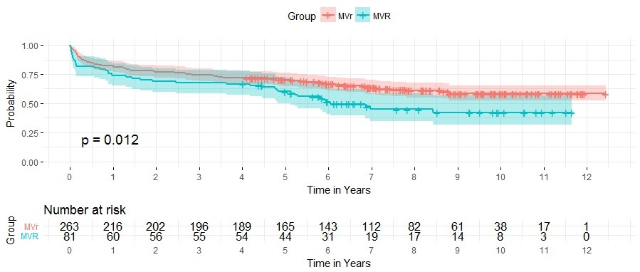

 
Qing Xu  
Codruta Chiuzan,PhD; Weijia Fan, MS; Isaac George, MD*;   
Departments of Biostatistics and *Surgery, Columbia University Irving Medical Center

***
##Overview
The study aims to determine the more effective surgical treatment of Functional mitral regurgitation by survival analysis of overall survival propability, overall readmission probability to hospital and readmission probability due to heart failure between Mitral valve repair and *Mitral valve replacement group. We found Mitral valve repair (MVr) has a higher overall survival probability than Mitral valve replacement (MVR) but no difference in readmission probability.  
 

##Background
**Functional mitral regurgitation (FMR)** is one of the most common complications following a myocardial infarction. **Mitral valve repair (MVr)** is the preferred surgical treatment of FMR despite limited evidence supporting its efficacy. **Mitral valve replacement (MVR)** is the alternative procedure typically reserved for patients who are higher risk or refractory to MVr.   
The purpose of this inter-disciplinary study is to evaluate the mid-term effectiveness of MVR vs MVr by studying hear-failure (HF) readmission rates and overall mortality.   
**Propensity score methods** allow causal inferences from non-experimental (observational) studies and can fix lack of randomization with large enough sample size. 
 

##Data
The data was from New York Presbyterian Hospital - College of Physicians and Surgeons of Columbia University and Leipzig Heart Center. 344 charts of FMR patients who received either MVr (n=263) or MVR (n=81) between 2004- 2016 at our institution were reviewed.  

Survival time, time of readmission to hospital and time of readmission due to heart failure were recorded as main outcomes. Baseline characteristics include 11 continuous variables and 21 categorical variables including medical history and Concomitant procedure.  
 

##Analysis
First do data cleaning and summary table for baseline characteristics and t test for continuous variables and chi-square test for categorical variables by treatment group. Then calculate **standardized difference** of each variable by Mitral valve repair (MVr) and Mitral valve replacement (MVR) to diagnosis balance between two groups;  

In a logistic regression model, the **propensity scores** are the predicted probabilities of receiving treatment, given the set of covariates; Calculate propensity score for each observation and match a 'MVR' subject with one that was 'MVr' within range of **0.01**.   

Use four cox models to compare overall survival time, overall readmission and heart failure readmission of MVr and MVR.    
1. **Unadjusted model**: use procedure (Mvr vs MVR) as the only variable in survival analysis based on the Cox proportional hazards model  
2. **Multivariate adjusted model**: choose variable that has standardized difference >0.1 and procedure in survival model with stepwise selection  
3. **Propensity Score Analysis Using Inverse Weighting**: weight = 1/prob if group=MVR and use weight=1/(1-prob) if group=MVr  
4. **Propensity Score Analysis using propensity score as a model covariate**  
 

##Result
####Baseline characteristics
The imbalanced variables are age, LVEF, LVEDD, NYHA Class, MR, TR, AI, DM, CKD, previous cardiac procedure, CABG, AVR, TVR and other cardiac procedure ([Table 1](./link_file/mvs_tables.pdf)). STS-score have collinearity to other variables so that they are excluded from models.   
After propensity score matching, we only got 35 pairs comparison which is too little for analysis so just use propensity score probability as inverse weight and covariate for unmatched observations. 

 

####Overall Survival Probability
Overall survival rate is higher in MVr than that in MVR (Fig 1.) and MVR has higher hazard in all four models (HR >1) and the conclusion is significant in three models except using propensity score as a covariate variable ([Table 2](./link_file/mvs_tables.pdf)).  
 

Fig 1. Kaplan-Meier plot for overall survival probability

 

####Overall Hospital Readmission
Overall readmission probability is higher in MVr than that in MVR but not significant different (Fig 2.) MVr has higher hazard in all four models (HR <1 ) but the conclusion is not significant in three models except in propensity score as inverse weight model([Table 3](./link_file/mvs_tables.pdf)). 
 

Fig 2. Kaplan-Meier plot for overall hospital readmission

 

####Hospital Readmission due to Heart Failure
HF readmission probability is slightly higher in MVr than that in MVR but not significant different (Fig 3.) MVr has higher hazard in all four models (HR <1 ) but the conclusion is not significant in three models except in propensity score as inverse weight model([Table 4](./link_file/mvs_tables.pdf)). 
 

Fig 3. Kaplan-Meier plot for hospital readmission due to heart failure

 

##Conclusion
Mitral valve repair (MVr) has a higher overall survival probability than Mitral valve replacement (MVR)(P=0.012).  
Surprisingly, Mitral valve replacement (MVR) has lower all-cause and heart-failure readmission probabilities, but not significantly different from MVr(P =0.23, P=0.13).  
One of limitations of this study is the small sample size. Due to the small number of matching pairs with propensity score, we use propensity score analysis rather than using matched pairs. The another reason that we end up with small balanced sample size is we have too many variables in the study.  
For further study, we can include more patients and look at death event only due to heart failure.  
 

##Reference
[1] Francesco Nappi, Functional mitral regurgitation: an overview for surgical management framework. Journal of Thoracic Disease, 2018;10(7):4540-4555 .  
[2] Guo, S. & Fraser, W.M. (2014). Propensity Score Analysis: Statistical Methods and Applications, Second Edition. Thousand Oaks, CA: Sage Publications.  
[3] Dongsheng Yang and Jarrod E. Dalton, A unified approach to measuring the effect size between two groups using SAS. SAS Global Forum 2012, paper 335-2012.  

**Read more about propensity score analysis from a great Lecture Note [Here](./link_file/PSM_Chiuzan_Mar2018.pdf).**
