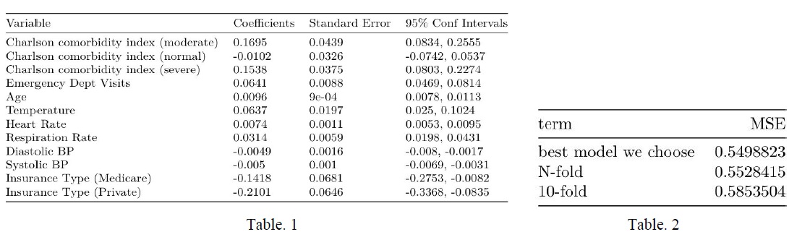

 
Departments of Biostatistics, Columbia University Mailman School of Public Health

***
##Overview
The purpose of this analysis was to investigate variables that could be used to predict a patient's length of stay in the hospital.  
After adjusting and transforming variables, we used automatic and criteria based procedures to create a model to best fit the data. Our resulting model was a **multiple linear regression** including the variables heartrate, is30dayreadmit, cindex , evisits, ageyear, temperature, respirationrate, insurancetype, bpsystolic, and bpdiastolic , and the resulting variables had a highly significant linear relationship with log length of stay. Although the relationship was significant, goodness of fit measures suggest a multiple linear regression may not be the best fit.  
 

##Background
Based on data from hospitals in 2012, the average cost of stay for an individual (at the average length of stay of 4.5 days) was $10,500. Minimizing length of stay in a hospital is of major concern to a hospital's 1 administration, as longer lengths of stay can lead to an increased financial burden for both the hospital and the patient.  
We would like to find out which variables are associated with length of stay in hospital (in days) and build a model that could be used to predict a patient's length of stay.

 

##Data
The data set contains a total of 3682 records from 3612 patients. We chose each patient's first visit and excluded observations from patients that visited the Intensive Care Unit (ICU) since it is likely that ICU patients will have more hospital-related conditions and thus a longer length of stay.  
We recombined some levels of categorical variables and converted impossible values into missing.    
We imputed missing values in which variables have less than five missig value by the mean of each variable. BMI had a very large number of missing values and was excluded from all of our models. The categorical variables MEWS , maritalstatus and insurancetype had too many missing observations to be imputed by mode, and too few missing observations to be entirely excluded, thus observations
with missing data for these variables were excluded from our models.  
 

##Analysis
We built several simple linear models between the outcome (log of length of stay) and each variable to investigate which variables were significantly associated with the outcome. We excluded gender, race, and maritalstatus, due to the fact that they did not have significant linear relationships with outcome. Religion had only a few significant levels, and we ultimately decided to remove the religion variable from our model since the R-squared was pretty low, showing religion was not capturing much of the variability in log of length of stay.  

Not all of the levels of insurancetype were significant, but we felt a patient's health insurance would have a major impact on how long they could stay in the hospital and we kept it in our models. We then used both stepwise regression based on AIC and Criterion-Based Procedures in R to find the best model. The stepwise regression returned a model with ten variables.  

This model agreed with the model generated from criterion-based procedures, using Adjusted R-squared, Cp and BIC. The final model showed that log of length of time is associated with **is30dayreadmit , cindex, evisit, ageyear , temperature , heartrate , respirationrate, bpdiastolic, bpsystolic** and **insurancetype**.  
 

##Result
The model was found to be highly significant, with a p-value of < 2.2e-16(Table 1). 
For predictive generalization, we used N-folds cross-validation and 10-folds cross-validation. The results are shown in Table 2. We can see that the mean squared error (MSE) of our final model is approximately 0.5499, while the MSE of N-fold cross validation and 10-fold crossvalidation are approximately 0.5528 and 0.5854, respectively.  

 

##Conclusion
There is a significant linear relationship between log of length of stay and our chosen variables.
Since the adjusted R-squared was less than 20%, we conclude that our model with this dataset might not provide accurate predictions. For this reason, we believe other (non-linear) methods might be a better fit for this data, and possibly in general for predicting length of stay in hospitals.  
There is little difference between the mean squared error in these cross validation methods and that of our final model, indicating our model has good predictive generalization.    
For further study, we may consider unsupervised learning such as random forest.  
 

##Reference
[1] Weiss AJ (Truven Health Analytics), Elixhauser A (AHRQ). Overview of Hospital Stays in the United States, 2012. HCUP Statistical Brief #180. October 2014. Agency for Healthcare Research and Quality, Rockville, MD.
[2] Heggestad, Torhild. "Do Hospital Length of Stay and Staffing Ratio Affect Elderly Patients' Risk of Readmission? A Nation-Wide Study of Norwegian Hospitals." Health Services Research , Blackwell Science Inc, June 2002.

**See the original report [here](./link_file/final.pdf).**