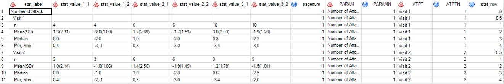
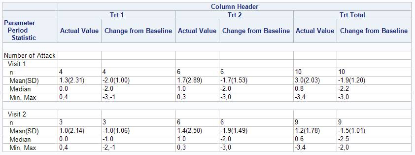

***
## Overview
It includes two macro to assign repeated label to variables and output table with spanning header:     
1. %label_data: Assign repeated labels to bunch of variables. Prepare for table output.    
2. %report: Output table by subgroup and with a spanning header.    
  
The example uses a fake data.

 

## Data
The fake data used in the example descriptive statistics of number of attack and change from baseline for treatment 1&2 and total from visit 1 to visit 2. 
 
Variables:  
 * stat_label: Text to show for the first column in the table output.  
 * stat_value_1_1: Statistics value of number of attack of treatment 1.  
 * stat_value_1_2: Statistics value of change from baseline of treatment 1.  
 * stat_value_2_1: Statistics value of number of attack of treatment 2.  
 * stat_value_2_2: Statistics value of change from baseline of treatment 2.    
 * stat_value_3_1: Statistics value of number of attack of total.    
 * stat_value_3_2: Statistics value of change from baseline of total.  
 * pagenum: Page number of output table.  
 * param: Paramater of the output.  
 * paramn: Numeric value of param which is also the subgroup variable.  
 * atpt: Visit name.  
 * atptn: Numeric value of atpt.  
 * stat_row: Sort number of statistics.  
 

 

## Output

 

## Full Code
[Code](./link_file/sas_macro_1_code.txt)